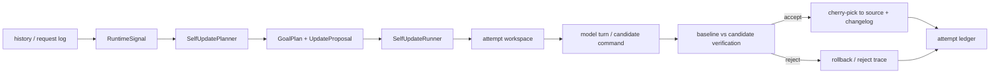

> **Summary**: This is not a vision piece. This post only analyzes a pipeline that is already implemented in the Sapience demo: extracting signals from interaction history, generating a goal plan, launching the model in an isolated workspace to modify Sapience itself, then using baseline/candidate verification, SWE smoke, sandbox execution, and an attempt ledger to decide whether a candidate can enter the main workspace.

The loop proposed in the previous post, *Self-Evolving Agent: Letting AI Rewrite Its Own Code from Interaction*, was:

```text
Interact -> Discover problem -> Modify own code -> Verify -> Deploy
```

What Sapience has been doing for the past two weeks is compressing this loop into a runnable engineering pipeline. It's still a demo, but it already has a clear technical skeleton:



This pipeline spans 5 major modules:

| Layer | Code Entry Point | Responsibility |
| --- | --- | --- |
| History Signals | `crates/sapience-runtime/src/history_analyzer.rs` | Extract `RuntimeSignal` from turn history, tool failures, and user friction keywords |
| Plan Generation | `crates/sapience-runtime/src/self_update.rs` | `SelfUpdatePlanner` generates `GoalPlan`, `UpdateProposal`, verification and rollback plans |
| Candidate Execution | `crates/sapience-runtime/src/self_update.rs` | `SelfUpdateRunner` creates an isolated attempt workspace and runs candidate modifications |
| Model Integration | `crates/sapience-cli/src/main.rs` / `sapience-tui/src/main.rs` | CLI/TUI injects the proposal into a real model turn |
| Safety Boundary | `crates/sapience-tools/src/sandbox.rs` / `self_modify.rs` | Sandbox execution, self-modification path constraints, patch validation, and failure recovery |

## 1. The Goal Plan Is Not a Todo List

Sapience doesn't let the model read a chunk of history and freely modify code. Before self-update, it generates a structured goal:

```rust
pub struct GoalPlan {
    pub active_goals: Vec<GoalItem>,
    pub retained_goals: Vec<GoalItem>,
    pub retired_goals: Vec<GoalItem>,
    pub rationale: String,
    pub next_steps: Vec<String>,
}
```

This is the minimal landing point of the goal-driven approach in code. Goals are not natural language suggestions in chat context — they are runtime objects. Subsequent candidate implementation, verification commands, and rollback strategies all revolve around this object.

`SelfUpdatePlanner::goal_plan_for_request` injects a strong constraint goal by default:

```rust
GoalItem {
    id: "preserve-quality-gates".to_owned(),
    description: "Keep fmt, check, clippy, test, deny, and SWE smoke at least as good as baseline.".to_owned(),
    priority: GoalPriority::Required,
    status: GoalStatus::Active,
}
```

This constraint is critical. The most common mistake a self-evolving system makes is breaking global quality gates to fix a local problem. Sapience puts quality gates into a required goal rather than leaving them as slogans in articles or READMEs.

## 2. The Proposal Describes Both "What to Change" and "How to Accept It"

The core artifact of a self-update is the `UpdateProposal`. It's not a patch — it's an execution contract:

```rust
pub struct UpdateProposal {
    pub id: String,
    pub title: String,
    pub goal_plan: GoalPlan,
    pub target_modules: Vec<String>,
    pub implementation_steps: Vec<String>,
    pub implementation_prompt: String,
    pub verification: VerificationPipeline,
    pub rollback: RollbackPlan,
    pub git: GitTracePlan,
    pub changelog: String,
}
```

The key here is `VerificationPipeline`:

```rust
pub struct VerificationPipeline {
    pub baseline_commands: Vec<CommandPlan>,
    pub candidate_commands: Vec<CommandPlan>,
    pub swe_smoke_command: CommandPlan,
    pub acceptance_rule: String,
}
```

This makes the proposal not just "please implement X," but also "how to prove X can be accepted." In the demo stage, the default candidate checks include `cargo fmt --all --check`, `cargo check --workspace --all-targets`, `cargo clippy`, `cargo test --workspace`, `cargo deny check`, and optionally `just swe-smoke`.

## 3. How Model Turns Connect to Self-Update

The CLI's model self-update entry point is `run_model_self_update_for_proposal_with_options`. It doesn't assemble a temporary prompt to call the model — instead, it launches Sapience's own runtime session:

```rust
let session = runtime
    .start_session(SessionId(format!("self-update-cycle-{proposal_id}")));
session.set_goal_plan(Some(goal_plan))?;
session.set_self_update_prompt(Some(implementation_prompt.clone()))?;
let outcome = run_session_turn_silent(&session, implementation_prompt).await?;
```

The runtime then injects the goal plan into the system instructions:

```rust
instruction.push_str("\n\nActive goals from the current self-update plan:\n");
for goal in &goal_plan.active_goals {
    let _ = writeln!(
        instruction,
        "- [{}] {:?}: {}",
        goal.id, goal.priority, goal.description
    );
}
```

This step solves a very practical problem: the candidate modification turn is not an ordinary chat — it shouldn't rely only on the last user message to constrain the model. Sapience promotes "current self-update goals" and "retained verification gates" to the system instruction layer, so the model executes candidate implementations under the same set of tools, the same turn loop, and the same request logs.

## 4. Candidate Code Never Touches the Main Workspace Directly

The most critical engineering decision in Sapience's self-update is the attempt workspace. `SelfUpdateRunner` creates an isolated candidate workspace under the main repository's `.git` directory:

```rust
let attempt_root = self
    .source_root
    .join(".git")
    .join("sapience-self-update")
    .join("attempts")
    .join(unique_attempt_workspace_name(&proposal.id));

let argv = vec![
    "git".to_owned(),
    "clone".to_owned(),
    "--local".to_owned(),
    "--no-hardlinks".to_owned(),
    "--quiet".to_owned(),
    self.source_root.display().to_string(),
    attempt_root.display().to_string(),
];
```

The complete sequence is:

```text
source clean check
  -> create attempt workspace
  -> copy git identity
  -> capture baseline ref
  -> run baseline verification
  -> run candidate hook/model turn in attempt workspace
  -> inspect candidate workspace status
  -> run candidate verification
  -> accept: commit attempt + fetch + cherry-pick --no-commit
  -> reject: preview or execute rollback
```

Two rejection conditions are worth examining closely:

```rust
if candidate_update_results.iter().any(|result| !result.success) {
    reject_candidate_update(..., "candidate update hook failed");
} else if candidate_update_results.is_empty() {
    reject_candidate_update(..., "candidate update did not run any implementation step");
} else if candidate_workspace_status.trim().is_empty() {
    reject_candidate_update(..., "candidate update produced no workspace changes");
}
```

This means "the model said it's done" doesn't count. The candidate must have actually run implementation steps and must leave a verifiable git diff.

## 5. Verification Is A/B, Not Just Running Candidate Tests

`SelfUpdateExecutor::execute_verification` supports running baseline and candidate phases:

```rust
let baseline_results = if options.verification_scope.runs_baseline() {
    self.run_commands(&baseline_commands)?
} else {
    Vec::new()
};

let candidate_results = if options.verification_scope.runs_candidate() {
    self.run_commands(&candidate_commands)?
} else {
    Vec::new()
};

let comparison = compare_verification(&baseline, &candidate);
```

For self-update, point testing isn't enough. The candidate version must be compared against baseline:

```rust
match (baseline.score, candidate.score) {
    (Some(base), Some(next)) if next < base => rejected,
    _ => accepted_if_required_commands_passed,
}
```

SWE smoke is an additional non-regression gate. `scripts/swe-smoke.sh` generates a temporary Rust fixture, has Sapience fix a failing test, and outputs:

```bash
echo "score=1"
```

The verifier parses `score=` from stdout/stderr and puts it into a scorecard. If the candidate makes the SWE smoke score drop below baseline, it gets rejected.

This is not a full SWE-bench, but at the demo stage it serves as a health check for "can the system still do basic code repair."

## 6. Tests Codify the Rejection Conditions

This self-update pipeline doesn't express intent solely through implementation code — the tests also explicitly define several negative boundary cases:

| Test | Codified Rule |
| --- | --- |
| `runner_rejects_score_regression_and_records_scorecard` | Reject when candidate score is lower than baseline; record the scorecard |
| `runner_rejects_swe_smoke_regression_even_when_other_verification_passes` | Still reject when normal verification passes but SWE smoke regresses |
| `runner_rejects_successful_candidate_that_does_not_change_workspace` | Reject when candidate commands succeed but produce no workspace changes |
| `runtime_self_update_prompt_can_drive_self_modify_patch` | Runtime-injected self-update prompt can drive the `self_modify` patch flow |

These tests are more valuable than "we'll be careful with rollback." They turn the demo's core safety assumptions into regression checks: scores cannot regress, SWE capability cannot regress, empty runs cannot be accepted, and self-update prompts must actually connect to the tool chain.

## 7. Sandbox Boundaries Enter the Verification Report

Self-update verification commands cannot be treated as equivalent to ordinary shell commands. Sapience abstracts command execution into a `SandboxRunner`:

```rust
pub fn strict(workspace_root: impl Into<PathBuf>) -> Result<Self> {
    let runner = Self::new(workspace_root)?;
    if runner.backend != SandboxBackend::Bubblewrap {
        bail!(
            "strict sandbox requires usable bubblewrap; local workspace fallback cannot enforce network isolation"
        );
    }
    Ok(Self { allow_local_fallback: false, ..runner })
}
```

Ordinary tools can fall back to the local workspace backend when bubblewrap is unavailable; self-update verification uses strict mode and requires a usable bubblewrap. Every command result is recorded:

```rust
SandboxExecutionMetadata {
    backend,
    workspace_write,
    network_disabled,
}
```

This isn't for show — it's so the changelog and attempt ledger have evidence: what boundary this candidate was verified under.

Additionally, parsing of `git`, `cargo`, `just`, and `sh` prioritizes environment variables:

```rust
"git" => executable_from_env_or_path("SAPIENCE_GIT", "git"),
"cargo" => executable_from_env_or_path("SAPIENCE_CARGO", "cargo"),
"just" => executable_from_env_or_path("SAPIENCE_JUST", "just"),
"sh" => executable_from_env_or_path("SAPIENCE_SHELL", "sh"),
```

This change comes from real debugging experience: in Nix, sandbox, or restricted environments, hardcoding binary paths makes the self-update pipeline non-reproducible.

## 8. TUI Turns Interaction History into Self-Update Input

Sapience's TUI doesn't just display chat — it compresses messages into history text:

```rust
match &message.role {
    MessageRole::User => lines.push(format!("user: {content}")),
    MessageRole::Assistant => lines.push(format!("assistant: {content}")),
    MessageRole::ToolCall { name } => {
        lines.push(format!("tool requested {name}: {content}"));
    }
    MessageRole::ToolResult { name, success } => {
        lines.push(format!("tool result {name} success={success}: {content}"));
    }
}
```

If request logging is enabled, it also extracts model request content from `requests.jsonl` to enrich the history:

```rust
fn tui_self_update_history(app: &App, request_log_path: Option<PathBuf>) -> String {
    enrich_tui_history_with_request_log(request_log_path, tui_history_text(app))
}
```

Then `/self-update idle-watch` runs periodically:

```text
tui history
  -> IdleSelfUpdateScheduler::tick
  -> ProposalOnly or Run
  -> SelfUpdateOrchestrator::evolve_from_history
```

This step moves self-evolution closer to real interaction, from an "offline command fed with manually prepared logs" to something that can review recent behavior during idle time and determine whether there's enough signal to trigger a self-update.

## 9. The Attempt Ledger Records Failures, Not Just Successes

A self-update system that only records accepted commits is untrustworthy. Rejected candidates better explain the system's boundaries.

Sapience's attempt ledger is JSONL, with each attempt writing:

```rust
serde_json::json!({
    "proposal_id": proposal.id,
    "proposal_title": proposal.title,
    "attempt": attempt.attempt,
    "max_candidate_attempts": max_candidate_attempts,
    "status": attempt.status,
    "summary": attempt.summary,
    "git_trace": attempt.git_trace,
    "candidate_update_count": attempt.candidate_update_count,
    "candidate_update_success": attempt.candidate_update_success,
    "swe_bench_gate": attempt.swe_bench_gate,
    "external_swe_bench_artifacts": attempt.external_swe_bench_artifacts,
})
```

When a candidate is accepted and the configuration allows commits, the ledger itself is also `git add`-ed and `git commit`-ed. This makes self-update part of the repository history, not an untraceable background action.

## 10. The Real Boundaries of the Current Demo

This implementation already has an engineering skeleton, but it cannot yet be called a production-grade self-evolving agent.

The areas that are still demo-level fall into three categories:

| Problem | Current State | Future Direction |
| --- | --- | --- |
| Signal Analysis | Primarily rules, keywords, and failure rates | Stronger structured event analysis and cross-session experience accumulation |
| Verification Scale | Workspace tests and SWE smoke | Integration with more realistic SWE-bench batches, performance regression, and long-term baselines |
| Permission Governance | Sandbox, path constraints, and rollback | Finer human approval strategies, permission layering, and immutable cores |

But this doesn't diminish the demo's significance. Sapience has already proven that self-evolution is not a mystical capability — it can be decomposed into several clear engineering interfaces:

```text
Signal -> GoalPlan -> Proposal -> AttemptWorkspace -> Verification -> Trace
```

The truly hard part isn't getting the model to write code — it's ensuring that after writing code, it remains constrained by goals, baselines, sandbox, tests, and audit trails.

## Conclusion

The most valuable implementation at this stage of Sapience is not the phrase "the agent can modify itself," but rather putting self-modification into a goal-driven engineering protocol:

- First, turn problems into `RuntimeSignal`
- Then turn signals into `GoalPlan`
- Then turn goals into `UpdateProposal` with acceptance criteria
- Candidate modifications are only allowed in the attempt workspace
- Verification must compare against baseline
- SWE smoke cannot regress
- Command execution must leave sandbox metadata
- Both successes and failures must enter the changelog / attempt ledger

This is what the demo stage should prove: not automatic correctness, but constraint, comparability, rollback, and auditability.
