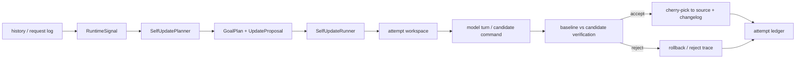

> **摘要**：这不是一篇愿景文。本文只分析 Sapience demo 阶段已经落地的一条链路：从交互历史提取信号，生成 goal plan，启动模型在隔离工作区修改 Sapience 自身，再用 baseline/candidate 验证、SWE smoke、沙箱执行和 attempt ledger 判断候选是否能进入主工作区。

上一篇《自进化 Agent：让 AI 从交互中改写自己的代码》提出的循环是：

```text
交互 -> 发现问题 -> 修改自身代码 -> 验证 -> 部署
```

Sapience 过去两周做的事情，是把这个循环压成一条可以运行的工程管线。当前仍是 demo，但它已经有一个明确的技术骨架：



这条链路跨了 5 个主要模块：

| 层 | 代码入口 | 职责 |
| --- | --- | --- |
| 历史信号 | `crates/sapience-runtime/src/history_analyzer.rs` | 从 turn history、工具失败、用户摩擦关键词中提取 `RuntimeSignal` |
| 计划生成 | `crates/sapience-runtime/src/self_update.rs` | `SelfUpdatePlanner` 生成 `GoalPlan`、`UpdateProposal`、验证与回滚计划 |
| 候选执行 | `crates/sapience-runtime/src/self_update.rs` | `SelfUpdateRunner` 创建隔离 attempt workspace，运行候选修改 |
| 模型接入 | `crates/sapience-cli/src/main.rs` / `sapience-tui/src/main.rs` | CLI/TUI 将 proposal 注入真实模型回合 |
| 安全边界 | `crates/sapience-tools/src/sandbox.rs` / `self_modify.rs` | 沙箱执行、自修改路径约束、patch 验证和失败恢复 |

## 1. Goal Plan 不是待办列表

Sapience 没有让模型直接读一段历史然后自由改代码。自更新前会先生成一个结构化目标：

```rust
pub struct GoalPlan {
    pub active_goals: Vec<GoalItem>,
    pub retained_goals: Vec<GoalItem>,
    pub retired_goals: Vec<GoalItem>,
    pub rationale: String,
    pub next_steps: Vec<String>,
}
```

这就是 goal-driven 方法在代码里的最小落点。目标不是聊天上下文里的自然语言建议，而是运行时对象。后续候选实现、验证命令、回滚策略都围绕这个对象展开。

`SelfUpdatePlanner::goal_plan_for_request` 会默认加入一个强约束目标：

```rust
GoalItem {
    id: "preserve-quality-gates".to_owned(),
    description: "Keep fmt, check, clippy, test, deny, and SWE smoke at least as good as baseline.".to_owned(),
    priority: GoalPriority::Required,
    status: GoalStatus::Active,
}
```

这条约束很重要。自进化系统最容易犯的错，是为了修一个局部问题破坏全局质量门禁。Sapience 把质量门禁放进 required goal，而不是放在文章或 README 里当口号。

## 2. Proposal 同时描述“要改什么”和“怎么验收”

一次自更新的核心产物是 `UpdateProposal`。它不是 patch，而是一个执行合同：

```rust
pub struct UpdateProposal {
    pub id: String,
    pub title: String,
    pub goal_plan: GoalPlan,
    pub target_modules: Vec<String>,
    pub implementation_steps: Vec<String>,
    pub implementation_prompt: String,
    pub verification: VerificationPipeline,
    pub rollback: RollbackPlan,
    pub git: GitTracePlan,
    pub changelog: String,
}
```

这里的关键是 `VerificationPipeline`：

```rust
pub struct VerificationPipeline {
    pub baseline_commands: Vec<CommandPlan>,
    pub candidate_commands: Vec<CommandPlan>,
    pub swe_smoke_command: CommandPlan,
    pub acceptance_rule: String,
}
```

这让 proposal 不只是“请实现 X”，还带着“如何证明 X 可以被接受”。在 demo 阶段，默认 candidate checks 包括 `cargo fmt --all --check`、`cargo check --workspace --all-targets`、`cargo clippy`、`cargo test --workspace`、`cargo deny check`，并可选 `just swe-smoke`。

## 3. 模型回合如何接入自更新

CLI 的模型自更新入口在 `run_model_self_update_for_proposal_with_options`。它没有单独拼一个临时 prompt 去调用模型，而是启动 Sapience 自己的 runtime session：

```rust
let session = runtime
    .start_session(SessionId(format!("self-update-cycle-{proposal_id}")));
session.set_goal_plan(Some(goal_plan))?;
session.set_self_update_prompt(Some(implementation_prompt.clone()))?;
let outcome = run_session_turn_silent(&session, implementation_prompt).await?;
```

运行时随后把 goal plan 注入系统指令：

```rust
instruction.push_str("\n\nActive goals from the current self-update plan:\n");
for goal in &goal_plan.active_goals {
    let _ = writeln!(
        instruction,
        "- [{}] {:?}: {}",
        goal.id, goal.priority, goal.description
    );
}
```

这一步解决了一个很实际的问题：候选修改回合不是普通聊天，不应该只靠最后一条用户消息约束模型。Sapience 把“当前自更新目标”和“保留验证门禁”提升到系统指令层，让模型在同一套工具、同一套 turn loop、同一套请求日志下执行候选实现。

## 4. 候选代码不直接碰主工作区

Sapience self-update 最关键的工程决策是 attempt workspace。`SelfUpdateRunner` 在主仓库的 `.git` 目录下创建隔离候选工作区：

```rust
let attempt_root = self
    .source_root
    .join(".git")
    .join("sapience-self-update")
    .join("attempts")
    .join(unique_attempt_workspace_name(&proposal.id));

let argv = vec![
    "git".to_owned(),
    "clone".to_owned(),
    "--local".to_owned(),
    "--no-hardlinks".to_owned(),
    "--quiet".to_owned(),
    self.source_root.display().to_string(),
    attempt_root.display().to_string(),
];
```

完整顺序是：

```text
source clean check
  -> create attempt workspace
  -> copy git identity
  -> capture baseline ref
  -> run baseline verification
  -> run candidate hook/model turn in attempt workspace
  -> inspect candidate workspace status
  -> run candidate verification
  -> accept: commit attempt + fetch + cherry-pick --no-commit
  -> reject: preview or execute rollback
```

两个拒绝条件值得单独看：

```rust
if candidate_update_results.iter().any(|result| !result.success) {
    reject_candidate_update(..., "candidate update hook failed");
} else if candidate_update_results.is_empty() {
    reject_candidate_update(..., "candidate update did not run any implementation step");
} else if candidate_workspace_status.trim().is_empty() {
    reject_candidate_update(..., "candidate update produced no workspace changes");
}
```

这意味着“模型说完成了”不算完成。候选必须真的运行过实现步骤，并且必须留下可检查的 git diff。

## 5. 验证是 A/B，不是只跑候选测试

`SelfUpdateExecutor::execute_verification` 支持按阶段跑 baseline 和 candidate：

```rust
let baseline_results = if options.verification_scope.runs_baseline() {
    self.run_commands(&baseline_commands)?
} else {
    Vec::new()
};

let candidate_results = if options.verification_scope.runs_candidate() {
    self.run_commands(&candidate_commands)?
} else {
    Vec::new()
};

let comparison = compare_verification(&baseline, &candidate);
```

对自更新来说，单点测试不够。候选版本必须和 baseline 比：

```rust
match (baseline.score, candidate.score) {
    (Some(base), Some(next)) if next < base => rejected,
    _ => accepted_if_required_commands_passed,
}
```

SWE smoke 是额外的非退化门禁。`scripts/swe-smoke.sh` 会生成一个临时 Rust fixture，让 Sapience 修复一个失败测试，最后输出：

```bash
echo "score=1"
```

验证器会解析 stdout/stderr 中的 `score=`，把它放进 scorecard。候选如果让 SWE smoke 分数低于 baseline，会被拒绝。

这不是完整 SWE-bench，但它在 demo 阶段起到了“系统还能不能做基本代码修复”的健康检查作用。

## 6. 测试把拒绝条件固化下来

这条自更新链路不是只靠实现代码表达意图，测试里也明确写了几个负例边界：

| 测试 | 固化的规则 |
| --- | --- |
| `runner_rejects_score_regression_and_records_scorecard` | 候选分数低于 baseline 时拒绝，并记录 scorecard |
| `runner_rejects_swe_smoke_regression_even_when_other_verification_passes` | 普通验证通过但 SWE smoke 退化时仍然拒绝 |
| `runner_rejects_successful_candidate_that_does_not_change_workspace` | 候选命令成功但没有产生工作区变更时拒绝 |
| `runtime_self_update_prompt_can_drive_self_modify_patch` | runtime 注入的 self-update prompt 能驱动 `self_modify` patch 流程 |

这些测试比“我们会小心回滚”更有价值。它们把 demo 的几个核心安全假设变成了可回归检查：分数不能退化、SWE 能力不能退化、空跑不能被接受、自更新 prompt 必须真的接到工具链。

## 7. 沙箱边界进入验证报告

自更新的验证命令不能和普通 shell 命令等价。Sapience 把命令执行抽成 `SandboxRunner`：

```rust
pub fn strict(workspace_root: impl Into<PathBuf>) -> Result<Self> {
    let runner = Self::new(workspace_root)?;
    if runner.backend != SandboxBackend::Bubblewrap {
        bail!(
            "strict sandbox requires usable bubblewrap; local workspace fallback cannot enforce network isolation"
        );
    }
    Ok(Self { allow_local_fallback: false, ..runner })
}
```

普通工具可以在 bubblewrap 不可用时退回 local workspace backend；self-update verification 用 strict 模式，必须有可用 bubblewrap。每个命令结果都会记录：

```rust
SandboxExecutionMetadata {
    backend,
    workspace_write,
    network_disabled,
}
```

这不是为了展示安全感，而是为了让 changelog 和 attempt ledger 有证据：这次候选是在什么边界下被验证的。

另外，`git`、`cargo`、`just`、`sh` 的解析优先走环境变量：

```rust
"git" => executable_from_env_or_path("SAPIENCE_GIT", "git"),
"cargo" => executable_from_env_or_path("SAPIENCE_CARGO", "cargo"),
"just" => executable_from_env_or_path("SAPIENCE_JUST", "just"),
"sh" => executable_from_env_or_path("SAPIENCE_SHELL", "sh"),
```

这个改动来自真实调试经验：在 Nix、沙箱或受限环境里，硬编码二进制路径会让自更新流程变得不可复现。

## 8. TUI 把交互历史变成自更新输入

Sapience 的 TUI 不只是显示聊天。它把消息压成 history text：

```rust
match &message.role {
    MessageRole::User => lines.push(format!("user: {content}")),
    MessageRole::Assistant => lines.push(format!("assistant: {content}")),
    MessageRole::ToolCall { name } => {
        lines.push(format!("tool requested {name}: {content}"));
    }
    MessageRole::ToolResult { name, success } => {
        lines.push(format!("tool result {name} success={success}: {content}"));
    }
}
```

如果开启了 request log，它还会从 `requests.jsonl` 里提取模型请求内容补充历史：

```rust
fn tui_self_update_history(app: &App, request_log_path: Option<PathBuf>) -> String {
    enrich_tui_history_with_request_log(request_log_path, tui_history_text(app))
}
```

然后 `/self-update idle-watch` 会周期性跑：

```text
tui history
  -> IdleSelfUpdateScheduler::tick
  -> ProposalOnly or Run
  -> SelfUpdateOrchestrator::evolve_from_history
```

这一步让自进化从“手动喂日志的离线命令”靠近了真实交互：系统可以在空闲时查看近期行为，判断是否有足够信号启动一次自更新。

## 9. Attempt ledger 记录失败，而不是只记录成功

自更新系统如果只记录 accepted commit，是不可信的。被拒绝的候选更能解释系统边界。

Sapience 的 attempt ledger 是 JSONL，每次尝试写入：

```rust
serde_json::json!({
    "proposal_id": proposal.id,
    "proposal_title": proposal.title,
    "attempt": attempt.attempt,
    "max_candidate_attempts": max_candidate_attempts,
    "status": attempt.status,
    "summary": attempt.summary,
    "git_trace": attempt.git_trace,
    "candidate_update_count": attempt.candidate_update_count,
    "candidate_update_success": attempt.candidate_update_success,
    "swe_bench_gate": attempt.swe_bench_gate,
    "external_swe_bench_artifacts": attempt.external_swe_bench_artifacts,
})
```

当候选 accepted 且配置允许 commit 时，ledger 本身也会被 `git add` 和 `git commit`。这让自更新变成仓库历史的一部分，而不是一次不可追踪的后台动作。

## 10. 当前 demo 的真实边界

这套实现已经有工程骨架，但还不能叫生产级自进化 Agent。

当前仍然偏 demo 的地方有三类：

| 问题 | 现状 | 后续方向 |
| --- | --- | --- |
| 信号分析 | 主要是规则、关键词和失败率 | 更强的结构化事件分析和跨会话经验沉淀 |
| 验证规模 | 有 workspace tests 和 SWE smoke | 接入更真实的 SWE-bench batch、性能回归和长期基准 |
| 权限治理 | 有沙箱、路径约束和回滚 | 更细的人类审批策略、权限分层和不可修改核心 |

但这并不削弱 demo 的意义。Sapience 已经证明，自进化不是一个神秘能力，它可以拆成几个明确的工程接口：

```text
Signal -> GoalPlan -> Proposal -> AttemptWorkspace -> Verification -> Trace
```

真正难的不是让模型写代码，而是让它在写完代码之后仍然受目标、baseline、沙箱、测试和审计约束。

## 结论

Sapience 这阶段最有价值的实现，不是“Agent 能改自己”这句话，而是把自修改放进了一个 goal-driven 的工程协议：

- 先把问题变成 `RuntimeSignal`
- 再把信号变成 `GoalPlan`
- 再把目标变成带验收规则的 `UpdateProposal`
- 候选修改只允许在 attempt workspace 中发生
- 验证必须和 baseline 对比
- SWE smoke 不能退化
- 命令执行必须留下 sandbox metadata
- 成功和失败都必须进入 changelog / attempt ledger

这就是 demo 阶段应该证明的东西：不是自动正确，而是可约束、可比较、可回滚、可审计。
